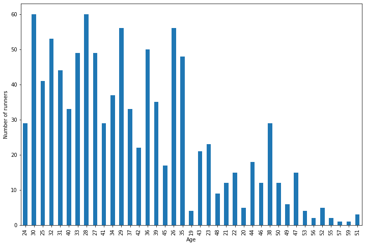
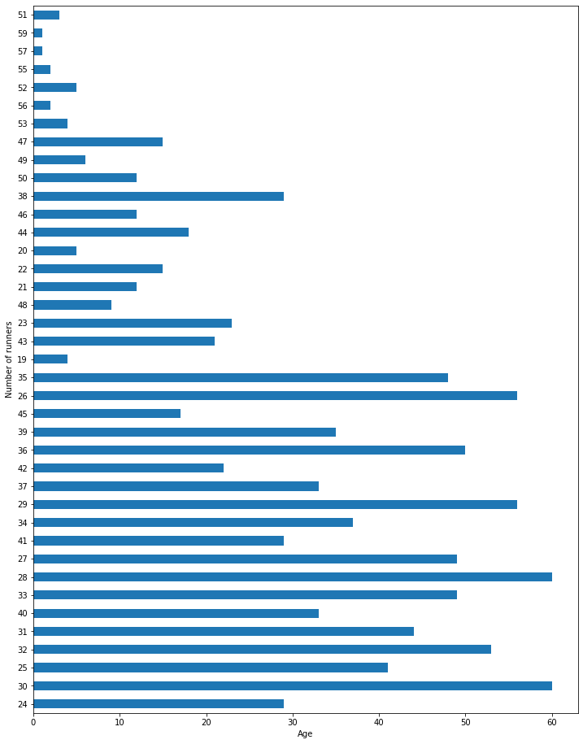
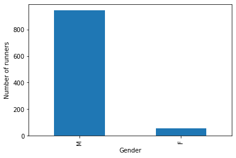

```python
import pandas as pd
import numpy as np
```


```python
boston = pd.read_csv('https://andybek.com/pandas-marathon')
```


```python
boston.head(10)
```


<div>
<style scoped>
    .dataframe tbody tr th:only-of-type {
        vertical-align: middle;
    }

    .dataframe tbody tr th {
        vertical-align: top;
    }

    .dataframe thead th {
        text-align: right;
    }
</style>
<table border="1" class="dataframe">
  <thead>
    <tr style="text-align: right;">
      <th></th>
      <th>Name</th>
      <th>Age</th>
      <th>M/F</th>
      <th>City</th>
      <th>State</th>
      <th>Country</th>
      <th>Official Time</th>
      <th>Overall</th>
      <th>Gender</th>
      <th>Years Ran</th>
    </tr>
  </thead>
  <tbody>
    <tr>
      <th>0</th>
      <td>Kirui, Geoffrey</td>
      <td>24</td>
      <td>M</td>
      <td>Keringet</td>
      <td>NaN</td>
      <td>KEN</td>
      <td>2:09:37</td>
      <td>1</td>
      <td>1</td>
      <td>NaN</td>
    </tr>
    <tr>
      <th>1</th>
      <td>Rupp, Galen</td>
      <td>30</td>
      <td>M</td>
      <td>Portland</td>
      <td>OR</td>
      <td>USA</td>
      <td>2:09:58</td>
      <td>2</td>
      <td>2</td>
      <td>NaN</td>
    </tr>
    <tr>
      <th>2</th>
      <td>Osako, Suguru</td>
      <td>25</td>
      <td>M</td>
      <td>Machida-City</td>
      <td>NaN</td>
      <td>JPN</td>
      <td>2:10:28</td>
      <td>3</td>
      <td>3</td>
      <td>NaN</td>
    </tr>
    <tr>
      <th>3</th>
      <td>Biwott, Shadrack</td>
      <td>32</td>
      <td>M</td>
      <td>Mammoth Lakes</td>
      <td>CA</td>
      <td>USA</td>
      <td>2:12:08</td>
      <td>4</td>
      <td>4</td>
      <td>NaN</td>
    </tr>
    <tr>
      <th>4</th>
      <td>Chebet, Wilson</td>
      <td>31</td>
      <td>M</td>
      <td>Marakwet</td>
      <td>NaN</td>
      <td>KEN</td>
      <td>2:12:35</td>
      <td>5</td>
      <td>5</td>
      <td>2015</td>
    </tr>
    <tr>
      <th>5</th>
      <td>Abdirahman, Abdi</td>
      <td>40</td>
      <td>M</td>
      <td>Phoenix</td>
      <td>AZ</td>
      <td>USA</td>
      <td>2:12:45</td>
      <td>6</td>
      <td>6</td>
      <td>NaN</td>
    </tr>
    <tr>
      <th>6</th>
      <td>Maiyo, Augustus K.</td>
      <td>33</td>
      <td>M</td>
      <td>Colorado Springs</td>
      <td>CO</td>
      <td>USA</td>
      <td>2:13:16</td>
      <td>7</td>
      <td>7</td>
      <td>NaN</td>
    </tr>
    <tr>
      <th>7</th>
      <td>Sefir, Dino</td>
      <td>28</td>
      <td>M</td>
      <td>Addis Ababa</td>
      <td>NaN</td>
      <td>ETH</td>
      <td>2:14:26</td>
      <td>8</td>
      <td>8</td>
      <td>NaN</td>
    </tr>
    <tr>
      <th>8</th>
      <td>Puskedra, Luke</td>
      <td>27</td>
      <td>M</td>
      <td>Eugene</td>
      <td>OR</td>
      <td>USA</td>
      <td>2:14:45</td>
      <td>9</td>
      <td>9</td>
      <td>NaN</td>
    </tr>
    <tr>
      <th>9</th>
      <td>Ward, Jared</td>
      <td>28</td>
      <td>M</td>
      <td>Kaysville</td>
      <td>UT</td>
      <td>USA</td>
      <td>2:15:28</td>
      <td>10</td>
      <td>10</td>
      <td>NaN</td>
    </tr>
  </tbody>
</table>
</div>


```python
# marathon players by age
```


```python
ax = boston.Age.value_counts(sort= False).plot(kind = 'bar', figsize=(12,8))
ax.set_xlabel('Age')
ax.set_ylabel('Number of runners')

```


    Text(0, 0.5, 'Number of runners')


    

    


```python
ax = boston.Age.value_counts(sort= False).plot(kind = 'barh', figsize=(12,16))
ax.set_xlabel('Age')
ax.set_ylabel('Number of runners')

```


    Text(0, 0.5, 'Number of runners')


    

    


```python
mf = boston['M/F'].value_counts().plot(kind = 'bar', linewidth = .4)
mf.set_xlabel('Gender')
mf.set_ylabel('Number of runners')
```


    Text(0, 0.5, 'Number of runners')


    

    


```python

```
